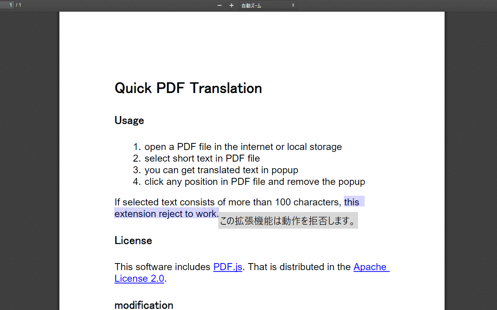

<h1>Quick PDF Translation</h1>

You can translate selected text in PDF into other language.

<h2>Usage</h2>

    <ol>
        <li>open a PDF file in the internet or local storage</li>
        <li>select short text in PDF file</li>
        <li>you can get translated text in popup</li>
        <li>click any position in PDF file to remove the popup</li>
    </ol>
    
If selected text consists of more than 100 characters, this extension reject to work.

    

<h2>License</h2>

    
This software includes <a href="https://mozilla.github.io/pdf.js/">PDF.js</a>. It is distributed in the
        <a href="LICENSE">Apache
            License 2.0</a>.

<h2>Privacy Policy</h2>

    
This extension sends selected text to my server to get translated text
        only when you enable this extension and select text in PDF file.
        My server stores personal information below for 10 weeks.

    <ul>
        <li>your IP address</li>
        <li>access time</li>
        <li>HTTP method(e.g. GET, POST)</li>
        <li>HTTP status code(e.g. 200,400,500)</li>
        <li>number of bytes of response without HTTP header</li>
        <li>HTTP User-agent(which browser you use)</li>
    </ul>
    
For more details, read <a href="https://docs.nginx.com/nginx/admin-guide/monitoring/logging/">document of
            NGIX</a>.
    

